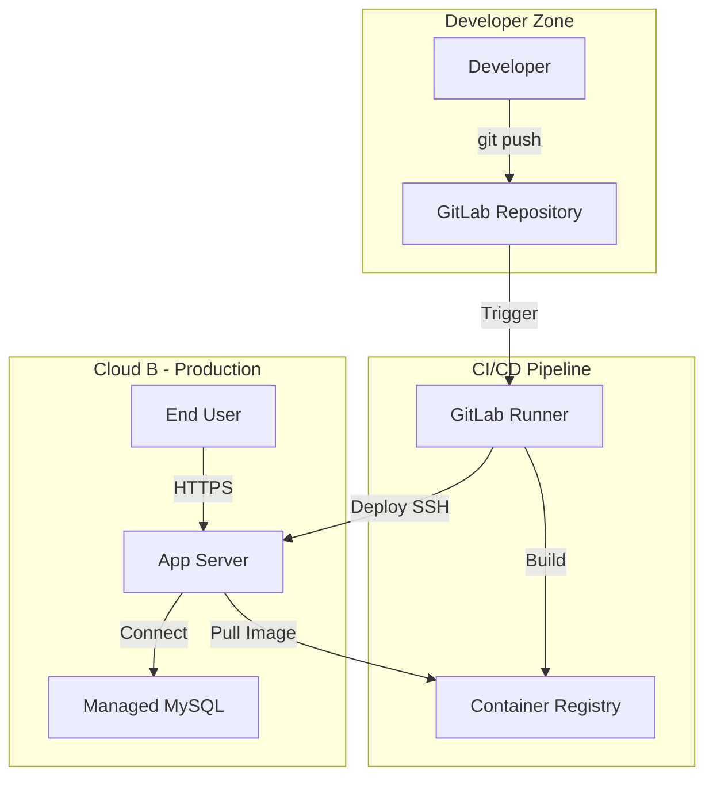

# 🚀 Кейс 1: Миграция и платформенная трансформация Legacy-проекта (Cloud A → Cloud B)

**Роль:** DevOps Engineer  
**Длительность:** ~68 часов (полный цикл от аудита до Post-Migration Support)  
**Стек:** Cloud VPS, GitLab CI, Kaniko, Docker, Traefik, Managed MySQL 8.0, Ansible, Bash, Python.

## 🎯 Проблема и Контекст
Проект работал в облаке "А" на устаревшей архитектуре (Container-Optimized OS, Instance Groups) с ручным деплоем. 
**Ключевые боли:**
- Отсутствие CI/CD и практик безопасности (Docker-in-Docker, запуск контейнеров от root).
- Жесткая привязка конфигурации фронтенда к среде сборки (требовалась пересборка образа для смены API URL).
- Риски потери данных и скрытые зависимости в DNS-зоне при миграции.

## 🛠 Инженерные решения (Action)

### 1. Архитектура и Security Hardening
- Спроектирована трехзвенная архитектура в облаке "Б" с изолированной приватной сетью.
- **Безопасный доступ:** Прямой SSH на продакшн-серверы закрыт. Весь доступ и деплой идут через Bastion-хост.
- **Immutable Infrastructure:** Внедрен деплой через **Docker Context**. На боевых серверах нет Git и исходного кода — только запуск контейнеров по защищенному SSH-туннелю.
- **Runtime Security:** Контейнеры запускаются с `cap_drop: ALL` и `no-new-privileges:true`. Для фронтенда точечно добавлены только `SETGID/SETUID`.

### 2. DevSecOps и CI/CD с нуля
- Полный отказ от DinD в пользу **Kaniko** для изолированной сборки образов.
- **Deep Healthcheck:** Написан кастомный Python-скрипт, проверяющий не только порт, но и физическое подключение к БД, и наличие PID-файлов фоновых процессов (Celery).
- **Frontend Runtime Config:** Реализован механизм `window._env_` и кастомный `docker-entrypoint.sh`. Артефакт стал универсальным: для смены API URL больше не требуется пересборка образа.

### 3. Управление рисками при миграции (Zero-Downtime)
- **Аудит DNS:** Выявлены скрытые зависимости (поддомены на IP облака "А"), которые не были учтены в исходном ТЗ. Проведена WHOIS-верификация.
- **Целостность данных:** Написан скрипт миграции БД с автоматической проверкой `Row Count`. 
- **План отката:** Подготовлен поэтапный план переноса NS-записей с сохранением TTL и MX/SPF/DKIM записей.

## 📊 Результаты и Метрики

| Метрика | Результат |
| :--- | :--- |
| **Целостность данных** | **100% совпадение** при миграции БД (скрипт верифицировал ~7 млн строк). |
| **Downtime при Cutover** | **< 60 минут** (включая смену DNS, выпуск SSL и фикс инцидента с конфигурацией). |
| **Безопасность** | Исключено хранение кода на Prod. Устранены уязвимости DinD и root-контейнеров. |
| **Скорость итераций** | Внедрен Git Flow. Деплой на Dev происходит автоматически при пуше, на Prod — по тегу. |

## 🏗 Архитектура решения

