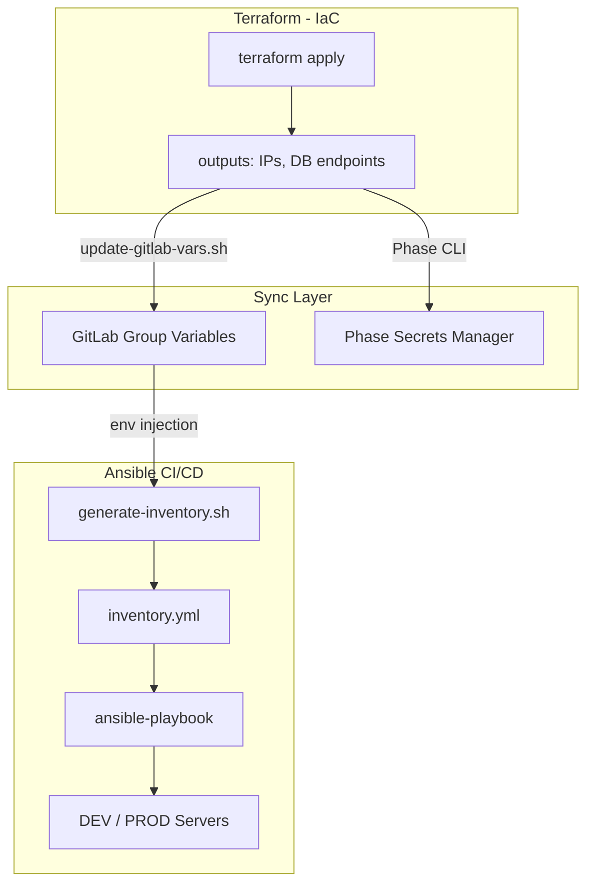

# 🔐 Кейс 2: Построение DevSecOps-платформы и IaC для EdTech-продукта

**Роль:** DevOps / Platform Engineer  
**Длительность:** ~176 часов (полный цикл: от миграции репозиториев до Production Ready)  
**Стек:** Terraform, Ansible, GitLab CI, Kaniko, Managed PostgreSQL, S3, Phase (Secrets Management), Bash.

## 🎯 Проблема и Контекст (Baseline)
Продуктовый проект в сфере онлайн-образования работал на VPS с ручным деплоем через low-code PaaS (Dokploy). 
**Ключевые боли:**
- Отсутствие отказоустойчивости (SPOF), ручная сборка на проде.
- Открытые технические порты (Traefik Dashboard, Swagger).
- Невозможность масштабирования: развертывание нового окружения занимало 2-3 дня ручной работы.

## 🛠 Инженерные решения (Action)

### 1. Infrastructure as Code (Terraform)
- Разработана модульная архитектура: код разделен на независимые слои (IAM, Network, Compute, Data).
- Внедрено разграничение прав доступа к S3 (Bucket Policies) для изоляции данных между сервисами.
- Автоматизировано создание VPC, Security Groups и Managed PostgreSQL кластеров.

### 2. Dynamic Inventory и автоматизация конфигурации (Ansible)
- **Проблема:** Как передать данные из Terraform (IP, endpoints) в Ansible без ручного копирования?
- **Решение:** Реализована схема `Terraform outputs → GitLab Group Variables + Phase Secrets → Ansible Inventory`.
- Написаны sync-скрипты (`update-gitlab-vars.sh`, `generate-inventory.sh`), которые автоматически обновляют inventory после каждого `terraform apply`.
- Построен Production-Ready Ansible CI/CD Pipeline: запуск пайплайна одной кнопкой → идентичная конфигурация на DEV и PROD.

### 3. DevSecOps и миграция данных
- Полный отказ от Dokploy в пользу GitLab CI с Kaniko (вместо DinD): low-code PaaS оставляла ручную сборку на проде и не давала воспроизводимости — заменена полностью декларативным пайплайном.
- Разработан универсальный скрипт миграции БД (`db_migrate_v3.sh`) с поддержкой PostgreSQL и автоматической верификацией целостности по таблицам.
- Миграция DEV и PROD баз данных выполнена с верификацией ~250 000+ строк.

## 📊 Результаты и Метрики

| Метрика | Результат |
| :--- | :--- |
| **Время развертывания окружения** | С 2-3 дней ручной работы до **10-15 минут** (одна кнопка в GitLab UI). |
| **ROI автоматизации** | Окупаемость на 2-м проекте: экономия ~65 часов на каждое развертывание. |
| **Надежность** | Конфигурация идемпотентна и воспроизводима: DEV и PROD настраиваются из одного пайплайна, человеческий фактор в настройке серверов исключен. |
| **Б?[200~?зопасность** | SSH только через Bastion, секреты в Phase/GitLab Variables (masked), S3 bucket policies. |

## 🏗 Архитектура синхронизации IaC

