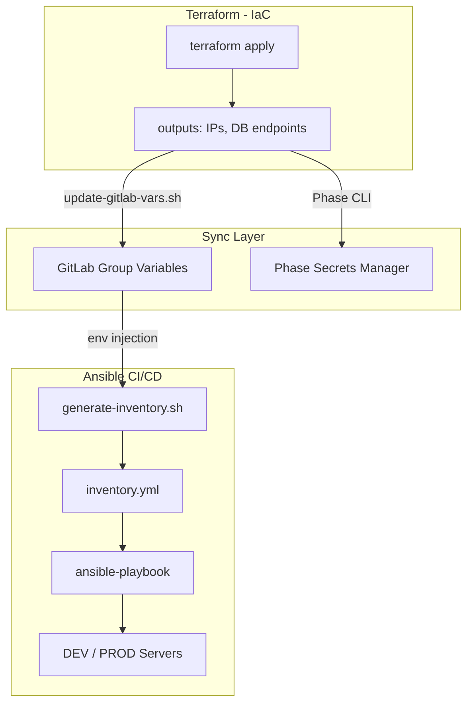

# 🔐 Кейс 2: Построение DevSecOps-платформы и IaC для EdTech-продукта

**Роль:** DevOps / Platform Engineer  
**Длительность:** ~176 часов (полный цикл: от миграции репозиториев до Production Ready)  
**Стек:** Terraform, Ansible, GitLab CI, Kaniko, Managed PostgreSQL, S3, Phase (Secrets Management), Docker, uv, Bash, Python.

## 🎯 Проблема и Контекст (Baseline)
Продуктовый проект в сфере онлайн-образования работал на VPS с ручным деплоем через low-code PaaS (Dokploy). 
**Ключевые боли:**
- Отсутствие отказоустойчивости (SPOF), ручная сборка на проде.
- Открытые технические порты (Traefik Dashboard, Swagger).
- Невозможность масштабирования: развертывание нового окружения занимало 2-3 дня ручной работы.

## 🛠 Инженерные решения (Action)

### 1. Infrastructure as Code (Terraform)
- Разработана модульная архитектура: код разделен на независимые слои (IAM, Network, Compute, Data).
- Внедрено разграничение прав доступа к S3 (Bucket Policies) для изоляции данных между сервисами.
- Автоматизировано создание VPC, Security Groups и Managed PostgreSQL кластеров.

### 2. Dynamic Inventory и автоматизация конфигурации (Ansible)
- **Проблема:** Как передать данные из Terraform (IP, endpoints) в Ansible без ручного копирования?
- **Решение:** Реализована схема `Terraform outputs → GitLab Group Variables + Phase Secrets → Ansible Inventory`.
- Написаны sync-скрипты (`update-gitlab-vars.sh`, `generate-inventory.sh`), которые автоматически обновляют inventory после каждого `terraform apply`.
- Построен Production-Ready Ansible CI/CD Pipeline: запуск пайплайна одной кнопкой → идентичная конфигурация на DEV и PROD.

### 3. DevSecOps и миграция данных
- Полный отказ от Dokploy в пользу GitLab CI с Kaniko (вместо DinD): low-code PaaS оставляла ручную сборку на проде и не давала воспроизводимости — заменена полностью декларативным пайплайном.
- Разработан универсальный скрипт миграции БД (`db_migrate_v3.sh`) с поддержкой PostgreSQL и автоматической верификацией целостности по таблицам.
- Миграция DEV и PROD баз данных выполнена с верификацией ~250 000+ строк.

### 4. Оптимизация артефактов контейнеров

**Baseline:** ML-образ для OCR/YOLO/Qdrant сервиса весил 5.24 GiB, тащил за собой CUDA/NVIDIA зависимости для GPU-инференса.

**Аудит и инсайт:** Провёл аудит среды развёртывания — модель запускалась на CPU-only сервере без GPU. CUDA-зависимости (torch GPU, torchvision, triton, nvidia-*, cuda-*) были избыточны и не использовались.

**Решение:**
- **Замена PyTorch:** GPU-версия заменена на CPU-версию через `pip install --index-url https://download.pytorch.org/whl/cpu` (официальная рекомендация PyTorch для CPU-only сред).
- **Фильтрация зависимостей:** Создан отдельный скрипт `scripts/filter_requirements.py`, который читает `/tmp/all-requirements.txt`, убирает GPU-зависимости (torch, torchvision, triton, nvidia-*, cuda-*, opencv-python) и пишет отфильтрованный список в `/tmp/filtered-requirements.txt`. Скрипт тестируем отдельно (`pytest`), логирует в stderr: `Filtered: kept 42, skipped 7 packages`.
- **Использование uv:** Перешёл на `uv` для установки отфильтрованных зависимостей — быстрее `pip`, лучше кэширование, надёжная работа с lock-файлами.
- **Multi-stage build:** Разделил Dockerfile на этапы: установка системных зависимостей → установка PyTorch CPU → фильтрация зависимостей → установка через uv → копирование кода.

```dockerfile
# ШАГ 1: Torch CPU через pip (официальная рекомендация PyTorch)
RUN pip install --no-cache-dir \
    --index-url https://download.pytorch.org/whl/cpu \
    torch torchvision

# ШАГ 2: Остальные зависимости через uv с фильтрацией CUDA
COPY --from=ghcr.io/astral-sh/uv:latest /uv /uvx /bin/
COPY pyproject.toml uv.lock ./
COPY scripts/filter_requirements.py /tmp/filter_requirements.py

RUN uv export --no-hashes --no-emit-project --no-dev > /tmp/all-requirements.txt \
    && python3 /tmp/filter_requirements.py \
    && uv pip install --system --no-deps -r /tmp/filtered-requirements.txt \
    && rm -f /tmp/all-requirements.txt /tmp/filtered-requirements.txt \
           /tmp/filter_requirements.py uv.lock pyproject.toml

# ШАГ 3: Код приложения + security hardening
COPY app/ ./app/
RUN useradd -m -u 1000 appuser && chown -R appuser:appuser /app
USER appuser
```

**Результат:** Размер ML-образа **5.24 GiB → 1.23 GiB (-77%)**. Ускорен деплой (меньше данных по сети), снижена нагрузка на Container Registry, упрощена доставка артефактов в продакшн-среду. Логика фильтрации вынесена в тестируемый скрипт — можно покрыть unit-тестами и переиспользовать в других проектах.

## 📊 Результаты и Метрики

| Метрика | Результат |
| :--- | :--- |
| **Время развертывания окружения** | С 2-3 дней ручной работы до **10-15 минут** (одна кнопка в GitLab UI). |
| **ROI автоматизации** | Окупаемость на 2-м проекте: экономия ~65 часов на каждое развертывание. |
| **Надежность** | Конфигурация идемпотентна и воспроизводима: DEV и PROD настраиваются из одного пайплайна, человеческий фактор в настройке серверов исключен. |
| **Безопасность** | SSH только через Bastion, секреты в Phase/GitLab Variables (masked), S3 bucket policies. |
| **Оптимизация артефактов** | ML-образ: **5.24 GiB → 1.23 GiB (-77%)** через замену PyTorch GPU на CPU и фильтрацию CUDA-зависимостей. |

## 🏗 Архитектура синхронизации IaC


