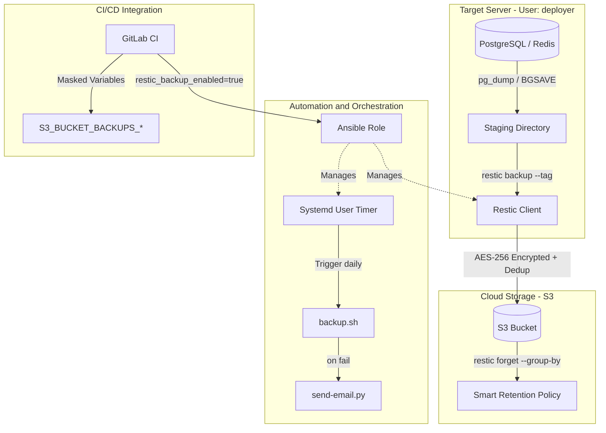

# 🛡️ Кейс 4: Построение отказоустойчивой системы резервного копирования

**Роль:** DevOps Engineer  
**Длительность:** ~34 часа (от разработки скриптов до комплексного тестирования и документации)  
**Стек:** Restic, Ansible, Bash, Python, GitLab CI, S3, Systemd (user-level).

## 🎯 Проблема и Контекст
Резервное копирование критических данных (PostgreSQL, Redis) выполнялось нестабильно или вручную.
**Ключевые боли:**
- Отсутствие шифрования и дедупликации при хранении в облаке.
- Риск "тихой" потери данных: скрипты не возвращали корректные коды ошибок, уведомления не приходили.
- Экспоненциальный рост снапшотов и отсутствие автоматической ротации.

## 🛠 Инженерные решения (Action)

### 1. Enterprise-grade скриптинг с честной обработкой ошибок
- Разработан `backup.sh` с retry-логикой (3 попытки для `pg_dump`) и корректными exit codes: `1` при полном провале, `0` с предупреждением при частичном успехе.
- Созданы интерактивные скрипты восстановления (`restore-postgres.sh`, `restore-redis.sh`) с обязательным подтверждением `yes/no` и поддержкой безопасного режима `--dry-run`.
- Выделен надежный Python-скрипт (`send-email.py`) для отправки уведомлений с корректной обработкой UTF-8 и MIME-заголовков (вместо ненадежных `curl`-хacks).

### 2. Идемпотентная автоматизация через Ansible
- Создана роль `restic_backup` в строгом корпоративном стиле: использование FQCN (`ansible.builtin.*`), разделение задач по файлам, `no_log: true` для чувствительных данных.
- **Траблшутинг Systemd:** Решена проблема запуска user-level таймеров без прав root. Поскольку стандартный модуль `systemd` терял контекст сессии при `become: yes`, активация выполнена через `ansible.builtin.shell` с явной передачей переменных окружения `XDG_RUNTIME_DIR` и `DBUS_SESSION_BUS_ADDRESS`.

### 3. Умная ротация и предотвращение "раздувания" хранилища
- **Проблема S3:** Restic считал каждую staging-директорию с уникальным timestamp новым путем, создавая дубликаты.
- **Решение:** Внедрены флаги `--tag daily_backup` при создании и `--group-by host,tags` при ротации (`restic forget`).
- **Проблема локальной очистки:** Команда `find -mtime +1` означала "строго больше 48 часов". Формула скорректирована на `find_days = LOCAL_RETENTION_DAYS - 1` (использование `-mtime +0` для корректной очистки старше 24 часов).

### 4. Бесшовная интеграция в CI/CD
- Роль добавлена в существующий шаблон с input-параметром `restic_backup_enabled`.
- Настроен строгий маппинг переменных: для бэкапов используются изолированные `S3_BUCKET_BACKUPS_*`, что гарантирует защиту от случайной перезаписи основного хранилища.

## 📊 Результаты и Метрики

| Метрика | Результат |
| :--- | :--- |
| **Надежность** | 100% автоматизация через user-level systemd timer. Честные exit codes и алертинг. |
| **Безопасность** | AES-256 шифрование на стороне клиента, дедупликация Restic, секреты скрыты через `no_log`. |
| **Эффективность хранения** | Исключен экспоненциальный рост снапшотов благодаря группировке по тегам и хостам. |
| **Developer Experience** | Предоставлен исчерпывающий Runbook с пошаговым восстановлением и разделом Troubleshooting. |

## 🏗 Архитектура процесса резервного копирования

